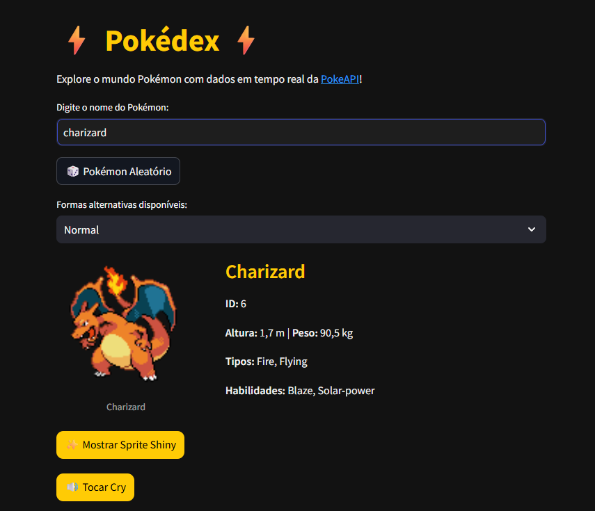
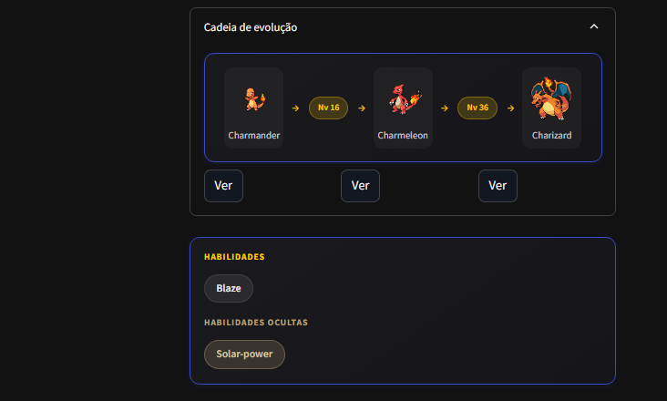
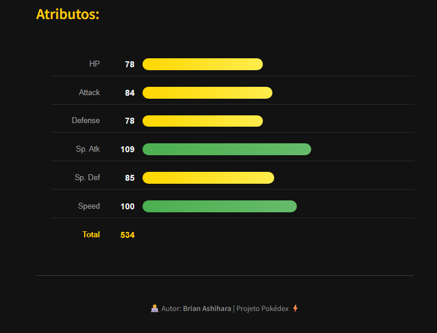

# ⚡ Pokédex ⚡

Uma **Pokédex interativa e moderna** construída com **Python** e **Streamlit**, que utiliza a **PokeAPI** para fornecer dados em tempo real sobre o universo Pokémon. Explore, descubra e aprenda sobre seus Pokémons favoritos com uma interface elegante em tema escuro.

---

## 🚀 Demonstração

<p align="center">
  
</p>
<p align="center">
  
</p>
<p align="center">
  
</p>

> Busque qualquer Pokémon, descubra um aleatório e veja suas informações completas na hora.

---

## ✨ Principais Funcionalidades

- **🔎 Pesquisa**: Busque por nome ou ID (pressione Enter para confirmar).
- **🎲 Pokémon Aleatório**: Um clique para abrir um Pokémon aleatório.
- **↔️ Navegação**: Botões Anterior / Próximo com pré-carregamento para troca rápida.
- **🖼️ Sprites**: Sprite normal e shiny, com alternância por botão.
- **🔊 Cry**: Áudio oficial do Pokémon (cuidado com o volume!).
- **🧬 Formas alternativas**: Todas as variedades da espécie (Mega, Gigantamax, regionais, etc.) em um seletor.
- **🔗 Cadeia de evolução**: Card com a linha de evolução, métodos (ex.: Nv 16) e botões "Ver" para ir a cada estágio.
- **🛡️ Tipos e dano**: Badges de tipos, fraquezas (2x/4x), resistências (0,5x) e imunidades (0x).
- **💪 Habilidades**: Card com pills para habilidades normais e ocultas.
- **📊 Atributos**: Gráfico de barras com HP, Ataque, Defesa, Sp. Atk, Sp. Def e Velocidade.
- **🎨 Interface**: Tema escuro, cards estilizados e layout amplo para evoluções de 3+ estágios.

---

## ⚙️ Tecnologias

- **Python 3**
- **Streamlit** – interface web
- **requests** – chamadas à PokeAPI
- **PokeAPI** – dados dos Pokémon (espécie, evolução, tipos, etc.)

O app usa cache (1 h) e requisições em paralelo onde faz sentido para melhorar a velocidade.

---

## 📂 Estrutura do Projeto

```
pokedex/
├── src/
│   ├── __init__.py
│   ├── pokeapi.py    # Chamadas à PokeAPI, cache, paralelismo
│   └── ui.py        # Estilos, badges, HTML (evolução, habilidades, stats)
├── .streamlit/
│   └── config.toml  # Configuração (ex.: headless para deploy)
├── assets/
│   ├── pokedex.png
│   └── atributos.png
├── pokedex.py       # App principal Streamlit
├── requirements.txt
└── README.md
```

---

## 🏁 Como rodar

1. **Clone e entre na pasta:**
   ```bash
   git clone https://github.com/BrianAshihara/pokedex.git
   cd pokedex
   ```

2. **Instale as dependências:**
   ```bash
   pip install -r requirements.txt
   ```

3. **Inicie o app:**
   ```bash
   streamlit run pokedex.py
   ```
   O navegador abrirá em `http://localhost:8501`.

Para deploy no **Streamlit Community Cloud**, use o arquivo principal `pokedex.py` na raiz do repositório.

---

<p align="center">
  Feito por <b>Brian Ashihara</b>
</p>
