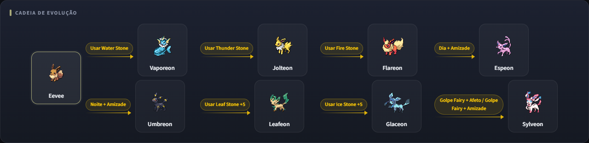

<h1 align="center">Pokédex</h1>

<p align="center">
  Pokédex web interativa construída com React, TypeScript e Vite, com dados em tempo real da <a href="https://pokeapi.co/">PokeAPI</a>.
</p>

<p align="center">
  
  
  
  
</p>

<p align="center">
  
</p>

## Sumário

- [Visão geral](#visão-geral)
- [Funcionalidades](#funcionalidades)
- [Stack](#stack)
- [Arquitetura](#arquitetura)
- [Executando localmente](#executando-localmente)
- [Deploy](#deploy)
- [Estrutura do projeto](#estrutura-do-projeto)
- [Roadmap](#roadmap)
- [Créditos](#créditos)

## Visão geral

O projeto reúne em uma única tela as informações mais consultadas sobre um Pokémon: tipos, atributos base, fraquezas e resistências, habilidades, formas alternativas e a cadeia de evolução completa. A interface segue a linguagem visual dos jogos da série principal, com layout em colunas no desktop e empilhado em telas menores.

A aplicação roda inteiramente no navegador: não há backend, e todos os dados vêm direto da PokeAPI.

## Funcionalidades

### Busca e navegação

- Busca por nome ou número da Pokédex nacional, tolerante a espaços, pontuação e acentos (`mr mime`, `deoxys`, `25`, `flabébé`).
- Navegação sequencial pela numeração nacional, exibindo o nome do Pokémon anterior e do próximo.
- Sorteio de um Pokémon aleatório entre todas as espécies disponíveis na API.
- URLs próprias para cada Pokémon (`/pokemon/charizard`), permitindo compartilhar links e usar o histórico do navegador. Links antigos no formato `?p=charizard` continuam funcionando.

### Informações exibidas

| Seção | Conteúdo |
| --- | --- |
| Card principal | Arte oficial, sprite em pixel ou animado, versão shiny, grito do Pokémon, tipos, categoria e marcação de lendário, mítico ou bebê |
| Dados da Pokédex | Altura, peso, proporção de gênero, taxa de captura, experiência base, geração e descrição |
| Habilidades | Habilidades regulares e oculta, com a descrição de cada uma |
| Dano recebido | Multiplicadores 4×, 2×, ½×, ¼× e 0× calculados a partir da combinação de tipos |
| Atributos base | Hexágono no estilo de Sword/Shield, barras por faixa de valor e mínimo/máximo no nível 100 |
| Formas alternativas | Mega, Gigantamax, formas regionais e demais variedades da espécie |
| Evolução | Árvore completa com ramificações (ex.: Eevee, Wurmple), métodos de evolução e links para cada estágio |
| Golpes | Golpes aprendidos por nível, ovo, MT e tutor em cada jogo, com tipo, categoria, poder, precisão, PP e efeito |

As preferências de exibição (estilo da imagem, shiny e jogo selecionado nos golpes) ficam salvas no navegador.

### Laboratório

Página separada (`/laboratorio`), acessível pelo menu no topo ou pelo botão "Abrir no Laboratório" no card do Pokémon.

- **Calculadora de atributos reais**: escolha nível, natureza, IVs e EVs e veja os atributos finais no hexágono, com o atributo favorecido pela natureza em vermelho e o desfavorecido em azul, como nos jogos. Inclui atalhos para IVs e distribuições comuns de EVs, e avisa quando o total passa de 510.
- **Comparador**: até três Pokémon com os hexágonos sobrepostos e tabela lado a lado destacando o maior valor de cada atributo, por atributos base ou nos níveis 50 e 100.

<p align="center">
  
</p>

## Stack

| Camada | Tecnologia |
| --- | --- |
| Linguagem | TypeScript |
| Interface | React 19, com CSS e SVG próprios (sem biblioteca de componentes) |
| Build | Vite |
| Rotas | React Router |
| Dados e cache | TanStack Query + `fetch` |
| Testes | Vitest |
| Lint | Oxlint |
| Fonte de dados | PokeAPI v2 |

## Arquitetura

O código é dividido em camadas com responsabilidades separadas:

- **`src/lib/`**: lógica sem dependência de interface.
  - **`pokeapi.ts`**: acesso à PokeAPI. Resolve nomes, busca espécies, tipos, habilidades, golpes e cadeias de evolução, e calcula a efetividade de tipos.
  - **`stats.ts`**: regras do jogo: fórmulas de atributos, naturezas e limites de IVs e EVs.
  - **`queries.ts`**: definições das consultas do TanStack Query usadas pelas telas.
  - **`format.ts`** e **`types.ts`**: formatação, cores por tipo e a tipagem dos dados da API.
- **`src/components/`**: componentes visuais (cards, hexágono de atributos, árvore de evolução, tabela de golpes) e controles reutilizáveis (select pesquisável, abas, slider, toggle).
- **`src/pages/`**: uma página por arquivo (`PokedexPage.tsx` e `LabPage.tsx`), responsáveis pelo layout e pelo estado de cada tela.
- **`src/state/`**: estado do Laboratório, compartilhado entre as páginas para não se perder ao navegar.

Decisões de desempenho:

- **Cache em duas camadas**: as respostas da PokeAPI ficam em um cache em memória por URL, que também evita requisições duplicadas simultâneas, e o TanStack Query guarda os dados já processados por uma hora.
- **Payload reduzido**: a resposta de `/pokemon` é compactada antes de entrar no cache (a lista de golpes, cerca de 90% do tamanho, vira um índice enxuto por jogo).
- **Requisições em paralelo**: tipos, habilidades, golpes, MTs e sprites da evolução são buscados em paralelo, com limite de 16 requisições simultâneas.
- **Carregamento independente**: cada seção carrega por conta própria com um esqueleto de carregamento, então a tela aparece antes de todos os dados chegarem.
- **Tratamento de falhas**: erros de rede não são cacheados e resultam em uma mensagem amigável na seção afetada, sem derrubar o restante da página.

## Executando localmente

**Pré-requisitos:** Node.js 20.19 ou superior e `npm`.

```bash
git clone https://github.com/BrianAshihara/pokedex.git
cd pokedex
npm install
npm run dev
```

A aplicação ficará disponível em `http://localhost:5173`.

Outros comandos:

| Comando | Descrição |
| --- | --- |
| `npm run build` | Verifica os tipos e gera a versão de produção em `dist/` |
| `npm run preview` | Serve localmente a versão gerada pelo build |
| `npm test` | Executa os testes unitários |
| `npm run lint` | Executa o lint |

## Deploy

O projeto está preparado para a [Vercel](https://vercel.com/):

1. Importe o repositório na Vercel. O framework Vite é detectado automaticamente (build `npm run build`, saída `dist`).
2. Clique em **Deploy**.

O arquivo `vercel.json` redireciona todas as rotas para o `index.html`, para que URLs como `/pokemon/charizard` funcionem ao abrir o link diretamente. Cada push para a branch `main` dispara um novo deploy automaticamente.

## Estrutura do projeto

```
pokedex/
├── assets/                    # Imagens usadas neste README
├── public/
│   └── favicon.svg
├── src/
│   ├── components/            # Componentes visuais e controles
│   ├── hooks/                 # Hooks reutilizáveis
│   ├── lib/                   # PokeAPI, fórmulas, formatação, tipos e testes
│   ├── pages/                 # Pokédex e Laboratório
│   ├── state/                 # Estado do Laboratório
│   ├── styles/
│   │   └── global.css         # Tema e estilos
│   ├── App.tsx                # Rotas e navegação
│   └── main.tsx               # Ponto de entrada
├── index.html
├── package.json
├── vercel.json                # Rotas da SPA na Vercel
├── vite.config.ts
└── README.md
```

## Roadmap

- [ ] Autocomplete na busca, com tolerância a erros de digitação
- [ ] Filtros por tipo, geração e categoria
- [ ] Montador de time com análise de cobertura de fraquezas
- [x] Testes automatizados das regras de jogo
- [ ] Pipeline de CI

## Créditos

Desenvolvido por **Brian Ashihara**.

Dados fornecidos pela [PokeAPI](https://pokeapi.co/). Pokémon e seus respectivos nomes são marcas registradas da Nintendo, Game Freak e The Pokémon Company. Este é um projeto de fãs, sem fins comerciais e sem afiliação oficial.
