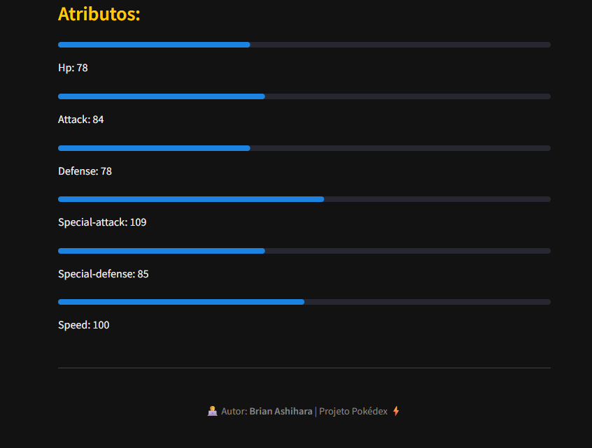

# ⚡ Pokédex - Projeto em Python

Uma **Pokédex interativa** desenvolvida em **Python** utilizando a **PokeAPI** e **Streamlit**.  
Permite buscar informações de qualquer Pokémon, exibindo nome, tipo, habilidades, peso, altura e atributos.

---

## 🚀 Demonstração




> Busque qualquer Pokémon e veja suas informações completas instantaneamente!

---

## ⚙️ Tecnologias Utilizadas

- 🐍 **Python 3**
- 🌐 **PokeAPI**
- 🎨 **Streamlit** (interface web)
- ⚙️ **Requests** (requisições HTTP)

---

## 🧠 Funcionalidades

- 🔎 Buscar Pokémon pelo nome  
- 📸 Exibir imagem oficial (sprite)  
- 🧩 Mostrar tipos, habilidades, peso e altura  
- 📊 Exibir atributos (HP, ataque, defesa, etc.) com barras de progresso 
- 🐉 Possibilita mostrar as formas alternativas do mesmo Pokémon (se houver)
- 🔊 Toca o "cry" do Pokémon (barulho que o Pokémon faz nos jogos oficiais) *Volume alto! 
- ❌ Tratamento de erros (Pokémon inexistente)

---

## 🏁 Como Executar

1. Clone o repositório:
   ```bash
   git clone https://github.com/BrianAshihara/pokedex.git
   cd pokedex

2. Importe o arquivo "requirements.txt":
   ```bash
   pip install -r requirements.txt

3. Execute a aplicação com o streamlit:
   ```bash
   streamlit run pokedex.py

